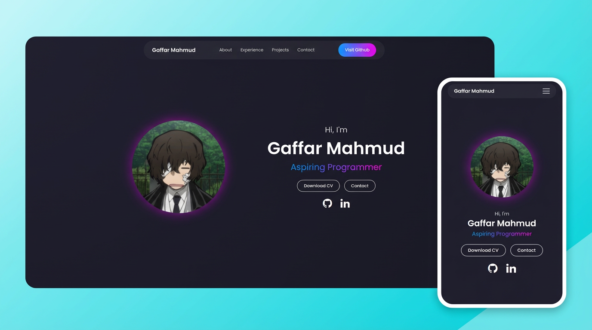

# 🌐 Portfolio-V1

A modern, responsive personal portfolio website built using **HTML, CSS,
and JavaScript**.

------------------------------------------------------------------------

## 🚀 Live Preview

🔗 Visit: https://gaffarmahmud.com




------------------------------------------------------------------------

## ✨ Features

-   Fully Responsive Design (Desktop, Tablet, Mobile)
-   Modern UI with Gradient Effects
-   Smooth Scroll Behavior
-   Mobile Hamburger Navigation
-   Scroll Reveal Animation
-   Clean Sectioned Layout (About, Experience, Projects, Contact)
-   Education & Skills Grid System
-   Social Media Integration (GitHub & LinkedIn)

------------------------------------------------------------------------

## 🛠️ Built With

-   HTML5
-   CSS3
-   JavaScript
-   Custom Fonts (Iconmoon)

------------------------------------------------------------------------

## 📁 Project Structure

    📦 Portfolio
     ┣ 📂 fonts
     ┣ 📂 media
     ┃ ┣ profile_picture.png
     ┃ ┣ project_1.png
     ┃ ┣ project_3.png
     ┃ ┣ project_3.png
     ┣ 📜 index.html
     ┣ 📜 style.css
     ┣ 📜 responsive.css
     ┣ 📜 app.js
     ┗ 📜 README.md

------------------------------------------------------------------------

## 📱 Responsive Design

Optimized for: - Large Desktops - Laptops - Tablets - Mobile
Devices - Small Mobile Screens - Landscape Phones

------------------------------------------------------------------------

## 🔧 How to Run Locally

``` bash
git clone https://github.com/zedxihan/portfolio-v1.git
cd portfolio-v1
open index.html
```

------------------------------------------------------------------------

## 🌱 Future Improvements

-   Add real project showcases
-   Add animations (GSAP or Framer Motion)
-   Dark/Light mode toggle
-   Rewrite using React and TypeScript

------------------------------------------------------------------------

## 👨‍💻 Author

**Gaffar Mahmud**\
📧 contact@gaffarmahmud.com\
🔗 https://github.com/zedxihan

------------------------------------------------------------------------

## 📜 License

This project is open-source and free to use for learning purposes.
